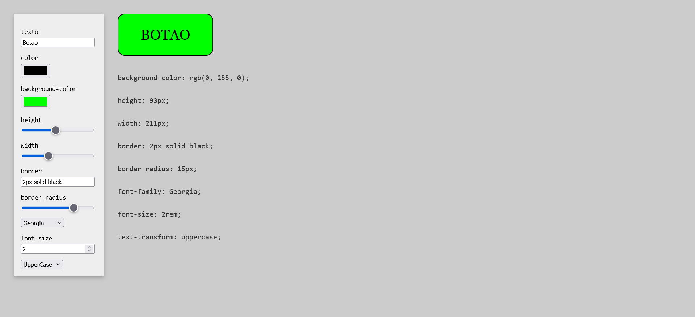

## ButtonCreator

_Crio uma função que recebe todos os valores e passa para um objeto_

    function handleChange(event) {

    const name = event.target.name;
    const value = event.target.value;

    handleStyle[name](value);

    saveValues(name, value);

    showCss();

    }

Depois pegos esses valores e chamo esse objeto onde é inserido name e value.

> handleStyle [name] (value);

No objeto ira armazenar diversos elementos onde todos serão aplicado no botão.

nesse objeto vou criar functions que irão formatar seu elementos respectivos.

_Quando é pego o valor, pegue a função que está dentro de `handleStyle` com o nome `texto` e execute-a com o valor fornecido._

    const handleStyle = {

    element: btn,

    texto(value) {
    this.element.innerHTML = value;
    },
    };

### Mostrando a descrições aplicadas

    function showCss() {

        cssText.innerHTML = '' +

        btn.style.cssText.split('; ')

        .join(';');

        }

## LocalStorage

Aqui vou salvar os valores no localStorage, pegando os valores e assimilando name com valor

    function saveValues(name, value) {

    localStorage[name] = value;

    }

#### Agora é criado uma function que coloca os valores nos campos

    function setValues() {

    const properties = Object.keys(localStorage);

    properties.forEach((propertie) => {

    handleStyle[propertie](localStorage[propertie]);

      controles.elements[propertie].value = localStorage[propertie];

    });

    showCss();

    }

    setValues();

# Button Creator

